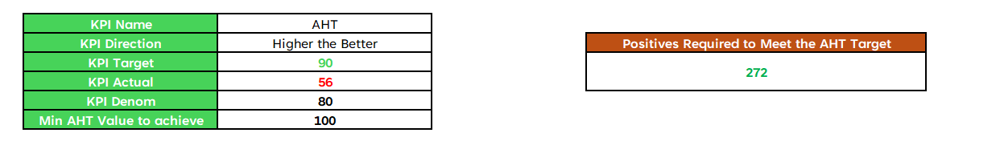

# 📊 KPI Projecter

KPI Projecter is an **Excel-based tool** that helps you calculate how many positives are required to meet your KPI targets.  
It is designed for analysts, managers, and teams who want a quick way to plan and track KPIs.

---

## 🚀 Features
- Input **KPI Name**, **Direction** (Higher/Lower is better), **Actual Value**, **Target Value**, and **Current Volume**.  
- Instantly calculates the **required positives** to meet your KPI target.  
- Easy-to-use Excel interface with clean visualization.  
- Works for multiple KPIs across different domains.  

---

## 📷 Preview
Here’s a snapshot of the KPI Projecter:

---

## 📂 Files Included
- `KPI_Projecter.xlsx` → The main Excel tool  
- `Projecter.png` → Screenshot of the tool  

---

## 🛠 How to Use
1. Open **KPI_Projecter.xlsx** in Excel.  
2. Enter:
   - **KPI Name**  
   - **Direction** → Higher the Better / Lower the Better  
   - **Actual Value** (your current performance)  
   - **Target Value** (desired goal)  
   - **Current KPI Volume** (denominator/base value)  
3. The tool will calculate how many **positives** are needed to achieve your KPI target.  

---

## 📌 Example
- KPI: Customer Satisfaction  
- Direction: Higher is Better  
- Actual Value: 78%  
- Target Value: 85%  
- Current Volume: 1,000 surveys  

👉 The tool will show how many more **positive responses** are required to meet the target.

---

## 📜 License
This project is released under the MIT License – free to use, modify, and share.  

---

## 🤝 Contributing
Pull requests and suggestions are welcome!  

---
